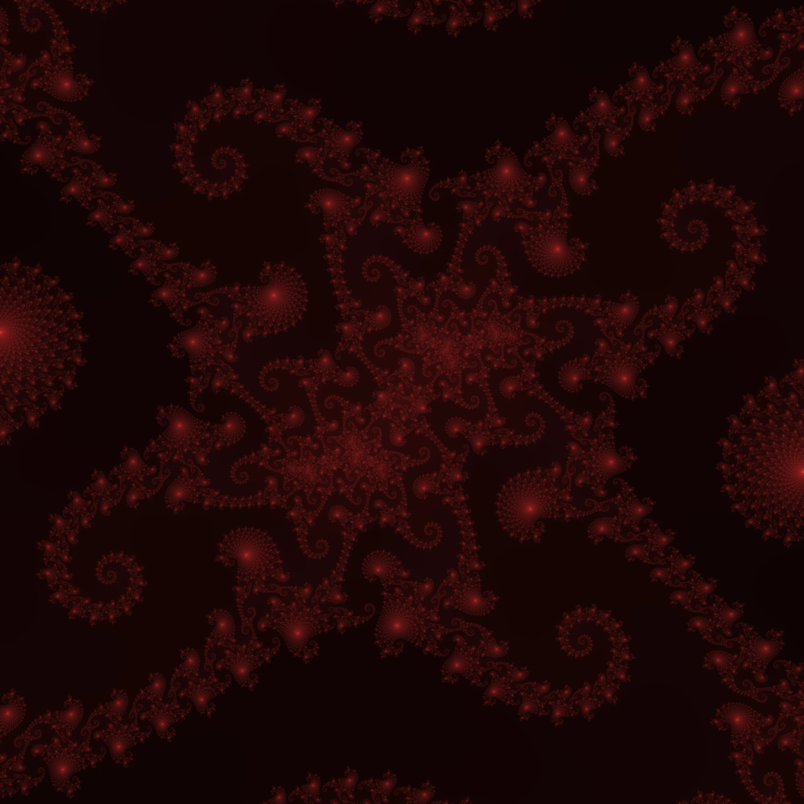

# 🌌 Julia Set Visualizer

Интерактивная визуализация множества Жюлиа, написанная на Go с использованием библиотеки [Ebiten](https://ebiten.org/).

## 🎯 Цель

Исследовать возможности Ebiten в создании интерактивных визуализаций и подготовиться к использованию её в более сложных и масштабных проектах в будущем.

## 📸 Превью

## 📺 Видео

[🔗 Смотреть видео на YouTube](https://www.youtube.com/watch?v=xol5e5jsCrY)

## ✨ Возможности

- Визуализация множества Жюлиа в реальном времени
- Навигация по фракталу с помощью клавиатуры
- Масштабирование изображения
- Плавная цветовая палитра на основе итераций
- Сохранение скриншота высокого качества

## 🎮 Управление

| Клавиша   | Действие                     |
|-----------|------------------------------|
| `W/A/S/D` | Перемещение по фракталу      |
| `Q/E`     | Масштабирование              |
| `U`       | Перерендер изображения       |
| `P`       | Сохранение скриншота         |
| `Z`       | Завершение программы         |
